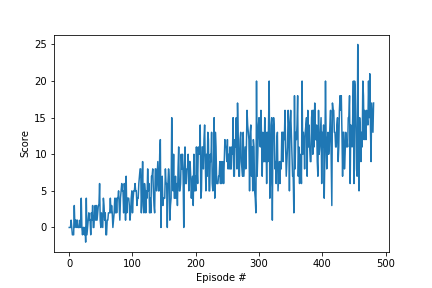

# Report - Deep Reinforcement Learning - Banana World
---
[Andreas Windisch, Jan. 2019](https://www.linkedin.com/in/andreas-windisch-physics/)

This notebook contains the documentation for Project 1 of the [Deep Reinforcement Learning Nanodegree](https://www.udacity.com/course/deep-reinforcement-learning-nanodegree--nd893). Feel free to play with this code as you please. Also, in case you have any questions or comments, or simply want to contact me, use the link to my LinkedIn profile above, or write me directly using [andreas.windisch@yahoo.com](andreas.windisch@yahoo.com). Have fun exploring this nice project! :-)

### 0. Learning Algorithm

In this project, I utilized the Deep Q-Network approach to train the Agent using discounting, a neural network as a function approximator, a fixed-Q target, a replay buffer and an epsilon-greedy policy. The core implementation has already been used as an example in class. With implementing only small changes to the previous code, the algorithm trained the Agent successfully. In the following, let me discuss the ingredients in more detail.

#### Neural Network as function approximator
In the Deep Q Algorithm, a Neural Network acts as a function approximator for the value function.
In this case, we used a fully connected, four-layer network with:
- 27 units (input layer)
- 64 units (1st hidden layer)
- 64 units (2nd hidden layer)
- 4 units (output layer)
As activation function, I used the Rectified Linear Unit (ReLU) function. The network is trained through feed-forward and back-propagation.

#### Discounting
With discounting, we wigh the rewards in future less than the ones in the nearere future. The discounting factor gamma has been chosen to be 0.99 in this case.

#### fixed Q-target
The goal of training the agent translates to minimizing the difference between the Temporal Difference target and the current value. The problem of the correlation of the weights in the current value and the difference in weights to be computed (moving target) can be addressed by using a fixed Q-target, where a separate network is maintained that is only updated every few steps. 

#### Experience Replay
Another issue that can arise in Deep Q Networks is, that we want to make use of very rare events, and also exploit the training Agent's experience as much as we can. One such approach is to maintain a replay buffer, from which we sample experience tuples at random. The random sampling is necessary in order to break the strong temporal correlation between the experience tuples. Here we used a buffer size of 10^5, a batch size of 64. The network is updated every 4 steps.

#### Epsilon greedy policy
When using an epsilon greedy policy, we only choose the reward maximizing action with the greatest probability, but we may also choose a different (and thus non-optimal) action. This is important in the earlier training, as the Agent doesn't have much experience yet, and shouldn't rely on a single action too much. The epsilon value starts at 1.0 and is ramped down through a multiplicative decay factor of 0.995 until it reaches its minimal value of 0.01, which it can't underrun.

#### Summary of hyper-parameters

- replay buffer size: 1e5
- batch size: 64
- gamma (discounting): 0.99
- tau (interpolation parameter soft update): 0.001
- lr (learning rate): 5e-4
- update rate: 4
- epsilon_start: 1.0
- epsilon_end: 0.01
- epsilon_decay: 0.995

### 1. Plot of Rewards
Here is a plot that shows the rewards over the episodes, as the agent is trained. We can clearly see, that the average score approaches the desired number of +13 as the number of episodes increases. In this case, it took 382 episodes to train the Agent (382 because the last 100 episodes have been subtracted, since the criterion is to maintain an average score of 13 over the last 100 episodes).

### 2. Ideas for Future Work
The chosen algorithm and hyperparameters for this problem worked really well for this environment and for the given training task. There are several possible improvements for future studies. For example, one could train the Agent using pixel information and a Convolutional Neural Network rather than ray information and a dense Neural Network. As far as the algorithm goes, there are also various improvements possivble. Apart from refining the hyperparameters to tweak the algorithm to optimal performance one could also implent prioritized experience replay or dueling DQNs to further improve the performance.
